---

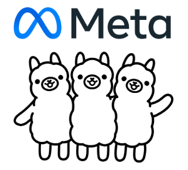{: width="500"}

## 2024年4月19日にMetaでLlama3がリリースされました！
今回、公開されたモデルは`8B、70B`の2種類です。
> 8B = パラメータが、80億個
{: .prompt-info }

128KサイズのTokenizerとGQA技法を使用して性能が向上したそうです。 今後`400B`以上のモデルも公開予定だそうで、性能が期待されます！

おそらく、私のPCでは難しいと思うので、久しぶりにハードウェアをアップグレードしたくなりますね。

#### ・Llama3の性能比較
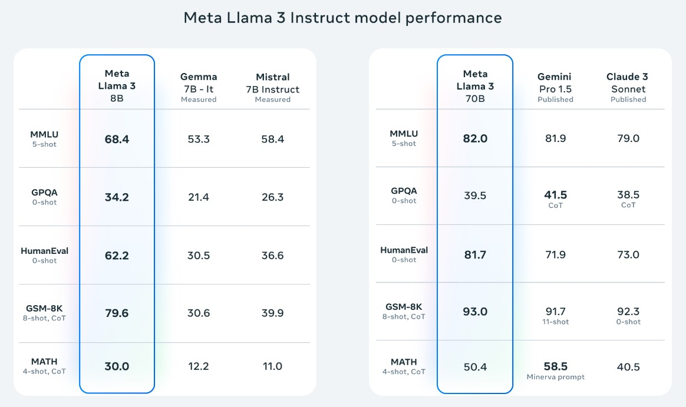{: width="500"}

もっと詳しく知りたい方は[**公式サイト**](https://llama.meta.com/llama3/)で確認できます。

---

## LLMモデルを実行させるための準備
すでに、AIに興味がある方は、[**Hugging Face**](https://huggingface.co/)でモデルをダウンロードし、ターミナルやOllamaに上げて、使用していると思いますが、非専攻者の場合、意味の分からないターミナルやコーディングのハードルが高くて使えない方も多いと思います。

そのため、本ポスティングでは非専攻者でも、ターミナルやコーディング無しで、自分のPCのローカル環境で`Llama3`を動かすことを目指します。

#### ・⬇️LM Studio ダウンロード
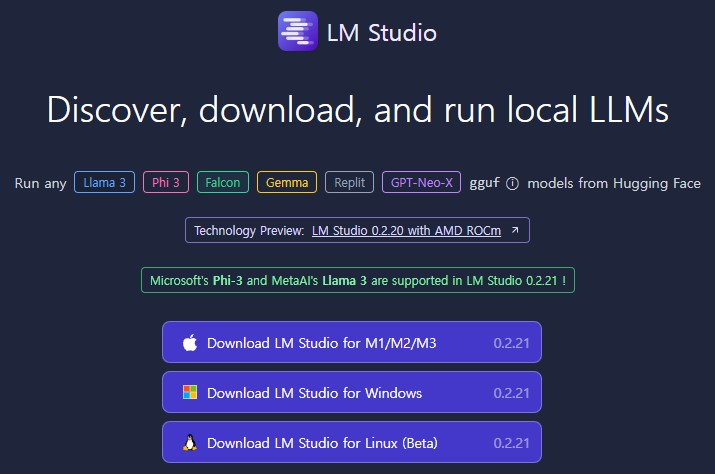{: width="500"}

LM Studioとは？

一般的な、ソフトウェアのように実行され、モデルを検索し、ダウンロードできるページも提供しています。

そのため、`UI環境`で簡単に自分が望むモデルをダウンロード及び実行して使用することが可能です！

Windows、Mac、Linuxに対応しているため、ほとんどのOSでも可能です。

[**公式サイト**](https://lmstudio.ai/)から、自分のOSに合わせてダウンロード後、インストールしてください！

#### ・🔎日本語が、学習されたLlama3モデル探し
日本語環境で、性能が優秀なAIを使うため、`日本語学習がされているLlama3モデル`を探してみます。

一般的に、AIモデルを探す時は [**HuggingFace**](https://huggingface.co/) を利用することになります。

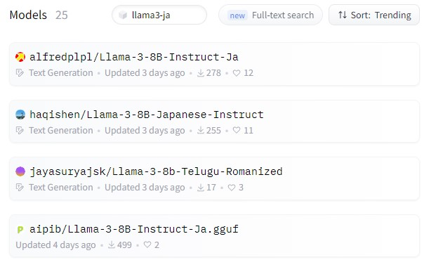{: width="500"}
_HuggingFaceでLlma3-jpの検索結果_

[**HuggingFace**](https://huggingface.co/)で`Llma3-jp`と検索すると、現在このような結果を確認できます。

> ポスティング作成時点では、`25個`モデルがありましたが、頻繁にアップロードされているので、結果が私と違うかもしれません！
{: .prompt-warning }

{: width="500"}
_https://huggingface.co/alfredplpl/Llama-3-8B-Instruct-Ja_

私は、Trendingで、ソートした後、[**一番上のモデル**](https://huggingface.co/alfredplpl/Llama-3-8B-Instruct-Ja)を使用したいと思います。

`Filesタブ`で、モデルを確認してみると、`gguf`拡張子のモデルがありませんでした。😓

> GGUF(Georgi Gerganov Unified Format)とは、LLMモデルの保存形式で`GGML、GGUF`などがあります。
{: .prompt-info }

[**HuggingFace**](https://huggingface.co/)で、もう少し探してみると、使用したい`Alfredplpl`のモデルを`gguf`に変換したモデルを見つけました！

直接変換も可能ですが、[**HuggingFace**](https://huggingface.co/)に、すばやくアップロードされているので、まずはご希望のモデルを検索することをおすすめ🙇‍♂️

>Alfredplpl-Llama-3-8B-Instruct-Ja-ggufの確認は、[**こちらへ**](https://huggingface.co/mmnga/alfredplpl-Llama-3-8B-Instruct-Ja-gguf)
{: .prompt-info }

#### ・🗜量子化レベル?

上記の[**リンク**](https://huggingface.co/mmnga/alfredplpl-Llama-3-8B-Instruct-Ja-gguf)から、`Fileタブ`を確認すると様々な形式の`GGUF`ファイルが存在します。

ファイル名をよく見ると、`Q1〜8`などに分かれています、これは`量子化レベル`を表記したもので、簡単に説明すると、数字が小さいほど圧縮率が高くなります。

圧縮率が高いため、どうしても情報の損失が発生する可能性があり、性能低下が発生します。

逆に数字が大きいほど性能が良いということです！

しかし、容量も高くなるので、自分の状況に合わせて選んでください。

> Q4 = 4-bit 量子化
>
> Q8 = 8-bit 量子化
{: .prompt-info }

---

## LM Studioで、モデルインストール
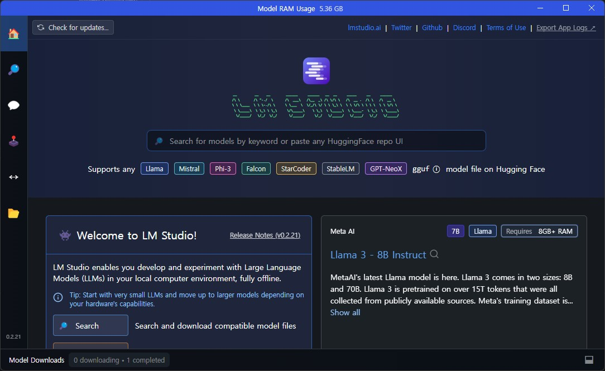{: width="500"}
_LM Studio起動後の画面_

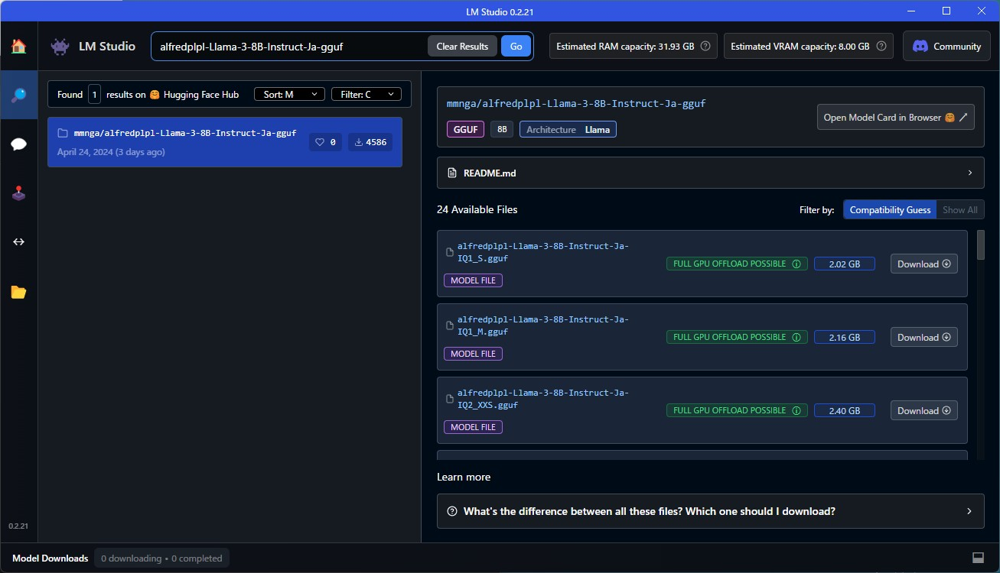{: width="500"}
_モデル検索後の画面_

`LM Studio`を起動した後、左側の`Searchタブ`に移動し、上記で見つけた `alfredplpl-Llama-3-8B-Instruct-Ja-gguf`を検索すると、そのリポジトリの`GGUF`モデルを全て確認ができます。

ご自身のPC仕様に合わせて、ダウンロードボタンをクリックして、ダウンロード及びインストールをしてください。

>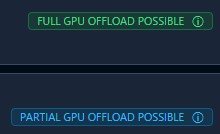{: width="100" .w-80 .left}
> 各モデルでこのような表示を確認することができますが、
> `緑色`は、自分のpc仕様で動作が安定、`青色`は、動作しない可能性があることを示しています。
{: .prompt-info }

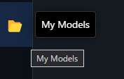{: width="150" .w-60 .left}
インストールが終わったら、左側メニューの`My Models`で、現在インストールされているモデルをすべて確認することができます。

_My Modelsページのインストールされたモデル確認_

インストールされたモデルで、`Default Preset`を`Llama3`に設定すると、今後からも便利です！

---

## LM Studioで、AI Chatを利用

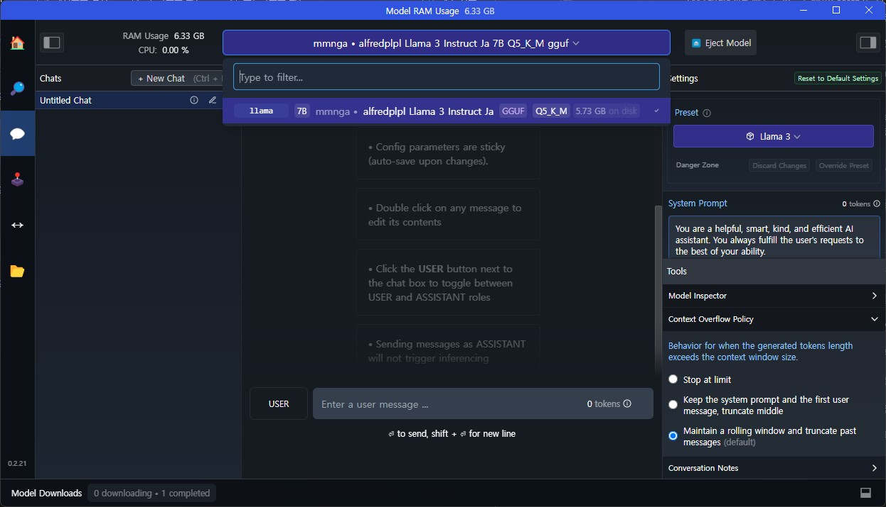{: width="500"}

左側メニューの`AI Chat`に移動すると、ChatGPTと似たUIが出ます！

インストールしたモデルを選択し、`Preset`が`Llama3`であることを確認してから、使用することができます！🎉

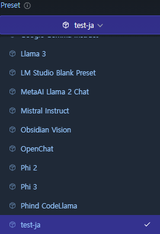

個人的には、Presetをカスタムして使用しています。

Presetカスタムについては、需要者が多い場合、追加で作成します。🙇‍♂️

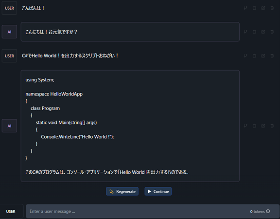{: width="500"}
_Llama3に質問した結果_

ChatGPTのように、トークンの心配なく気ままに使えるようになりましたね🙌

これで、非専攻者も自分のPCのローカル環境で、`Llama3`を使う方法を調べてみました！

お疲れ様でした！

---

## (Tip) 個人的な使い方
左側メニューに`Local Server`が、あります。

`Local Server`では、自分のPCをサーバーとして使用し、AIを使用することが可能です。

これを利用して、AIを利用したアプリを開発する時、有用に使っています。😆

#### ・Obsidianをおすすめ！
非開発者には、[**Obsidian**](https://obsidian.md/)をおすすめします！

[**Obsidian**](https://obsidian.md/)は、メモや文書作成などに便利ですのでお世話になっています。🙇‍♂️

[**Obsidian**](https://obsidian.md/)に、Copilot Pluginをインストール後、LM StudioにインストールしたLlama3を連動して[**Obsidian**](https://obsidian.md/)内部で、AIの使用が可能です。

#### ・Obsidianに、Llama3連動

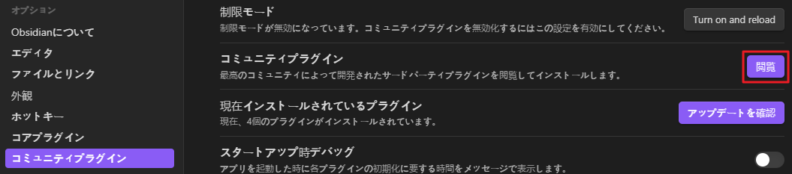{: width="500"}
_設定 / コミュニティプラグイン_

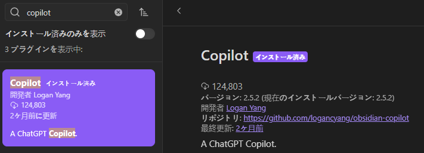{: width="500"}
_Copilotを検索後、活性化_

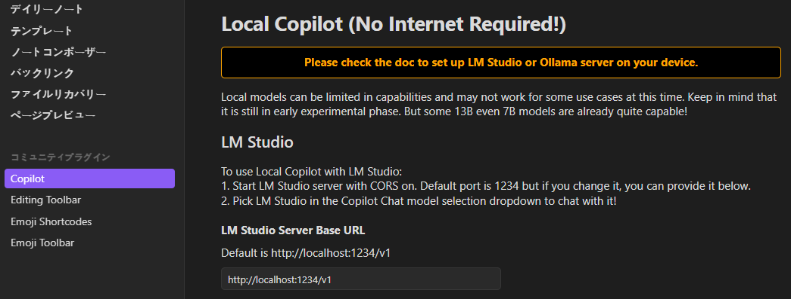{: width="500"}
_Copilot設定_

#### ・ObsidianでAI Chatを利用してみよう

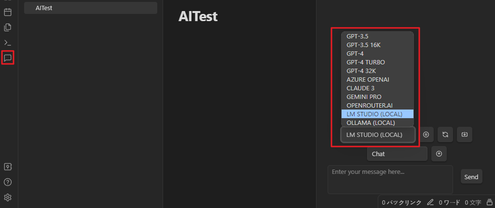{: width="500"}

左側の`Copilot Chat`アイコンをクリックし、右側の`Copilot Chat`が開いたら`LM STUDIO`を選択して使用できます！

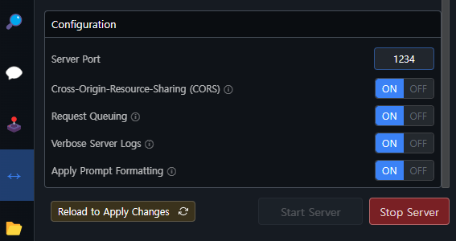{: width="500"}
> 事前に、LMSTUDIOでサーバー実行が必須！
{: .prompt-warning }

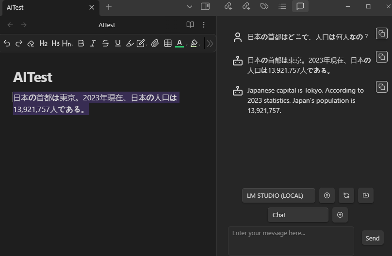{: width="500"}
_Obsidianで、AI Chatを使用結果_

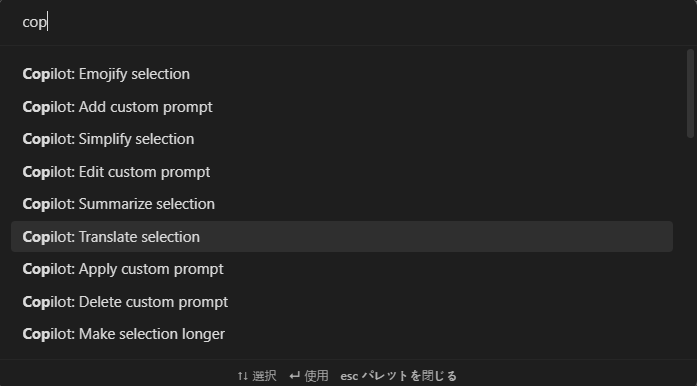{: width="500"}
_コメントパレット機能を利用して英文に自動翻訳_

本ポスティングでは、詳しくは説明しないですが、このように文書を作成中AIが使えるようになりました！
