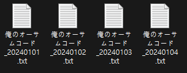
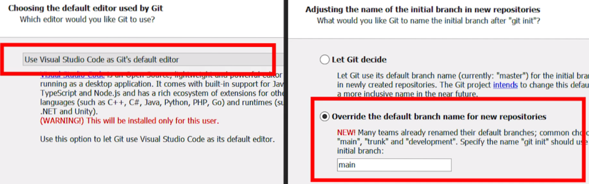
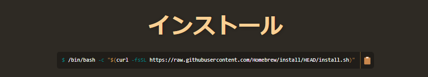

{: width="500"}

---

## なぜGitを使うのか？
作業中、テストで作成した`データを削除したい`、`数日前の作業に戻りたい`、ということはよくあります。

このような時、どうすれば以前の作業に戻れるのでしょうか？

{: width="500"}
_毎日毎日作業内容をコピーして保存する。_

{: width="500"}
_バージョン管理ソフトを使う。_

<br/>

一般的に、開発の学習や実務では`Git`が最もよく使われます。

Gitを使用すると、作業したコードを安全かつ簡単に記録・保管でき、作業中に過去の状態に移動することが可能です。

これにより、作業中にミスをしても元の状態に戻ることができ、これまでの作業履歴を確認することもできます。


<br/>

Gitはエンジニアだけでなく、デザイナーやプランナーなど、プロジェクトに携わる開発者にとっても大いに役立つツールです。

ということで、今回の`「初めて学ぶGit&GitHubシリーズ」`では、難しい原理や概念は一旦置いておいて、すぐにGitを使えるようになることを目指します！

<br/>

> 本シリーズでは、Sourcetree、Fork、GitKrakenなどの`Git GUIツール`は使用しません。
> 学習するには少し難しいかもしれませんが、GUIツールの使い方はほとんど似ているため、本シリーズを学び終えた後で、自分の好みに合ったGUIツールを選んで使用できるようにするためです。
{: .prompt-warning }

------

## 実習に使用するIDEのインストール
本シリーズでは、実習に使用するIDEとして[VSCode](https://code.visualstudio.com/Download)を使用します。

Gitのインストール前に、まずVSCodeをインストールしてください。

------

## Gitのインストールと設定

#### ・Window
[Git公式サイト](https://git-scm.com/downloads)から、Gitをダウンロードしてインストールしてください。

{: width="500"}

> インストール時、本シリーズをわかりやすくするため、上記の設定を行ってください。
{: .prompt-warning }

------

#### ・Mac

{: width="500"}

[Homebrew](https://brew.sh/ja/)を利用してGitをインストールします。

[Homebrew公式サイト](https://brew.sh/ja/)から、`インストール`コマンドをコピーしてターミナルで実行するとインストールされます。

以下のコマンドを使用しても良いですが、公式サイトのコマンドと比較してから使用してください。

<br/>

###### <center>[Homebrewインストールコマンド]</center>
```bash
/bin/bash -c "$(curl -fsSL https://raw.githubusercontent.com/Homebrew/install/HEAD/install.sh)"
```

<br/>

Homebrewのインストールが完了したら、下記のコマンドでGitをインストールします。

<br/>

###### <center>[Gitインストールコマンド]</center>
```bash
brwe install git
```

<br/>

Gitのインストールが完了したら、本シリーズをわかりやすくするため、設定を変更してください。

<br/>

###### <center>[Git設定変更コマンド]</center>
```bash
# 基本ブランチ名をmainに設定。
git config --global init.defaultBranch main
# 基本のGitエディタをVSCodeに設定。
git config --global core.editor "code --wait"
```

------

#### 共通
Gitのインストールが完了後、ユーザー登録を行う必要があります。

希望する場所に作業用フォルダを作成し、そのフォルダのパスで`PowerShell(Win)`や`Terminal(Mac)`を開いて、次のコマンドを使用してユーザー登録を行ってください。

<br/>

###### <center>[ユーザー登録コマンド]</center>
```bash
git config -global user.email "山田太郎@gamil.com"
git config -global user.name "山田太郎"
```
<br/>

###### <center>[ユーザー登録確認コマンド]</center>

```bash
git config --global user.email
山田太郎@gamil.com
git config --global user.name
山田太郎
```

<br/>

------

これで基本的なGitのインストールと環境設定が終わりました！

次回は、`git add`と`commit`を使ってファイルを記録する方法について説明します。