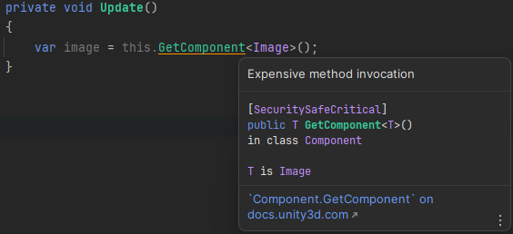
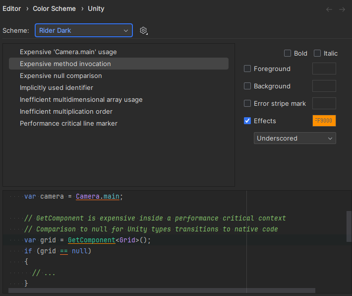
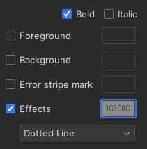
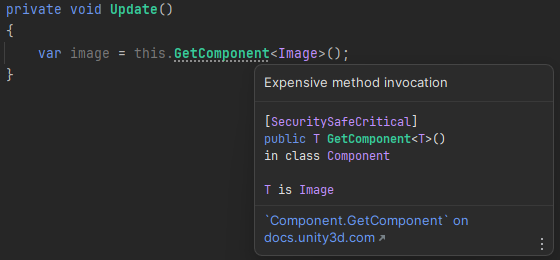

---
## Color Schme 変更前
{: width="500"}

私は、Unity開発時に使用する`IDE`として`JetBrains`社の`Rider`を使用していますが、最近開発中に`Expensive method invocation`が頻繁に発生しています。

`Expensive method invocation`は、費用が多く発生するメソッドを呼び出す場合、お知らせする機能ですが、実際、開発仕様によって多くのメソッド費用が発生しない場合もよくあります。

それでも便利な機能ですが、私が不便なのは、エラーと似たような形をしているので、気分が悪いという程度...？

ため、`Rider`の`Expensive method invocation Color Scheme`を変更したいと思います！

---

## Color Schmeの設定方法
{: width="500"}

`Rider`の`Settings/Editor/Color Schme/Unity`のパスに移動すると、現在のSchemeのオプションを確認することができます。

このうち、私が不便に思ってた`Expensive method invocation`をクリックして設定を変更することができ、変更された`Color Schme`がリアルタイムで下のテストスクリプトに表示されます。

{: width="250"}

私は目障りなく、重いということを表現するために、`Bold`と`Effects`の色を石に似た明るいグレーを使いたいと思います！

画像のように、`Bold`をチェックしてフォントを厚くし、`Effects`のタイプを`Dotted Line`に変更した後、色(140, 140, 140)を変更しました。

---
## Color Schme変更後

{: width="500"}

望み通りに適用されました！🎉

`Expensive method invocation`以外にも様々なオプションがあるので、テストスクリプトを確認しながら直接カスタムしてみましょう！

---

今日はここまで！
{: .text-center }