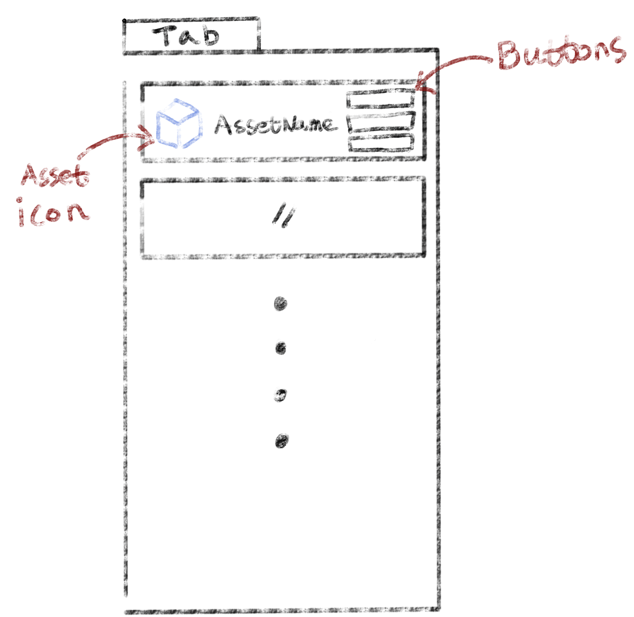
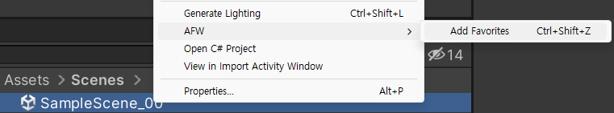
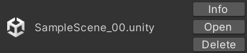
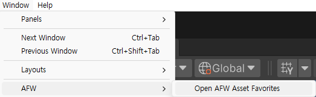
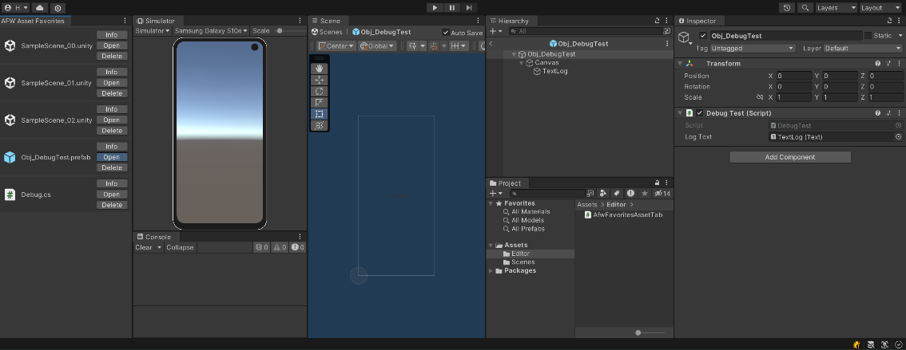

---
## Favorites Asset Tab
Unity作業中、いろんなシーンを移動しながら作業をしたり、作業中のアセットの経路を探すため苦労していませんか？

Unityで、`Favorites`機能を提供していますが、見づらいと思って、私が望むアセットのみエディタの隅に追加し、いつもワンクリックで使いたいと思っていました！

実際、このような機能を持つアセットは無料~有料を問わず、立派なアセットが本当にたくさんありますが、私が望む機能はシンプルなので直接作ってみました。

---

## 仕様


とてもシンプルな仕様になります。

1. Window(unity) `Tab`があり、そこに追加した`アセットリストを表示`します。
2. 追加したアセットは、`ボックスに入れて区切`ります。
3. 追加したアセットは、`アイコン`、`名前`、`ボタン`で構成されます。
4. ボタンは、Inspectorに情報を表示する`Info`、アセットを開く`Open`、アセットを削除する`Delete`で、3つのボタンで構成されます。
5. Tabのサイズより追加されたアセットが多い場合は、`スクロール`を使用して縦に表示します。
6. Window(unity) Tabを閉じても、`追加したアセットを保存`し、再びWindow(unity)Tabを開いたときに、`保存されたアセットを表示`します。
7. アセットの追加は、選択したアセットで右クリックした後、該当メニューをクリックするか、ショートカットキーを利用して追加する。

---

## 完成したスクリプト共有
> 2024/05/08 アップデート
>
> FavoritesAssetTabに、追加されたアセットをUnityから削除する場合、エラーが発生するバグがありました。
>
> OnGUIで、Favorites Asset List Drawするとき、ファイルが存在するかどうかを確認するロジックを追加しました。
{: .prompt-danger }

```c#
using System.Collections.Generic;
using System.IO;
using UnityEditor;
using UnityEngine;

/// <summary>
/// カスタムタブを作成し、お気に入り登録したアセットを表示します。
/// </summary>
public class AfwFavoritesAssetTab : EditorWindow
{
    #region [Var]

    /// <summary>
    /// 保存された Favorites Asset List を EditorPrefs に保存する時、使用する Key
    /// </summary>
    private const string AssetListKey = "AfwAssetFavoritesTab_AssetList";

    /// <summary>
    /// Favorites Asset List を保存する List
    /// </summary>
    private List<string> _favoriteAssetsList = new List<string>();

    /// <summary>
    /// スクロール位置を格納するベクトル
    /// </summary>
    private Vector2 _scrollPosition;

    /// <summary>
    /// 削除する Favorites Asset List の Index を保存する変数
    /// -1 は削除しないという意味
    /// </summary>
    private int _assetIndexToDelete = -1;

    #endregion

    #region [Fun - MenuItem]

    /// <summary>
    /// 選択したオブジェクトを Favorites Asset List に追加
    /// メニューアイテム : Assets/AFW/Add Favorites
    /// ショートカット: Ctrl + Shift + Z
    /// </summary>
    [MenuItem("Assets/AFW/Add Favorites %#z")]
    private static void AddAssetToFavoritesFromMenu()
    {
        // 選択したオブジェクトのパスを取得
        var selectedObject = Selection.activeObject;
        var assetPath = AssetDatabase.GetAssetPath(selectedObject);

        // 選択したファイルが存在するかを確認
        if (File.Exists(assetPath))
        {
            // AfwAssetFavoritesTab Window 取得
            var window = GetWindow<AfwFavoritesAssetTab>("AFW Asset Favorites");
            // リストに追加
            window._favoriteAssetsList.Add(assetPath);
            // 追加した、リストを保存
            window.SaveFavoriteAssets(window._favoriteAssetsList);
        }
        else
            UnityEngine.Debug.LogError($"{assetPath}が、存在しません！");
    }

    /// <summary>
    /// メニューアイテムの有効性確認
    /// メニューアイテム : Assets/AFW/Add Favorites
    /// ショートカット: Ctrl + Shift + Z
    /// </summary>
    [MenuItem("Assets/AFW/Add Favorites %#z", true)]
    private static bool ValidateAddAssetToFavoritesFromMenu()
    {
        // 選択したオブジェクトがある場合、メニュー アイテムを有効にする
        return Selection.activeObject != null;
    }

    /// <summary>
    /// Favorites Asset Tap Window を開く
    /// メニューアイテム : Window/AFW/Open AFW Asset Favorites
    /// </summary>
    [MenuItem("Window/AFW/Open AFW Asset Favorites")]
    private static void OpenFavoritesTab()
    {
        GetWindow<AfwFavoritesAssetTab>("AFW Asset Favorites");
    }

    #endregion

    #region [Fun - OnGUI]

    /// <summary>
    /// GUI イベントを処理
    /// </summary>
    private void OnGUI()
    {
        // Favorites Asset List をロード
        LoadFavoriteAssets();

        // スクロールビュー開始
        _scrollPosition = GUILayout.BeginScrollView(_scrollPosition);

        // Favorites Asset List Draw
        for (int i = 0; i < _favoriteAssetsList.Count; i++)
        {
            // ファイルが存在するかを確認
            if (File.Exists(_favoriteAssetsList[i]))
            {
                DrawAssetEntry(_favoriteAssetsList[i], i);
            }
            else
            {
                // ファイルが存在しない場合、リストから削除
                _favoriteAssetsList.RemoveAt(i);
                SaveFavoriteAssets(_favoriteAssetsList);
                // ファイルが存在しないため、Indexは-- 
                i--;
            }
        }

        // スクロールビュー終了
        GUILayout.EndScrollView();

        // 削除する Favorites Asset がある場合、削除
        if (_assetIndexToDelete != -1)
        {
            _favoriteAssetsList.RemoveAt(_assetIndexToDelete);
            SaveFavoriteAssets(_favoriteAssetsList);
            // 削除後、初期化
            _assetIndexToDelete = -1;
        }
    }

    /// <summary>
    /// アセットエントリをDraw
    /// </summary>
    /// <param name="assetPath">Draw する Asset のパス</param>
    /// <param name="index">エントリの Index</param>
    private void DrawAssetEntry(string assetPath, int index)
    {
        // パスをエディタ内での Asset パスに変換
        string relativePath = assetPath.Replace(Application.dataPath, "Assets");
        // Asset パスに対応する Asset オブジェクトをロード
        Object obj = AssetDatabase.LoadAssetAtPath<Object>(relativePath);
        // Asset オブジェクトの内容を取得
        GUIContent fileContent = EditorGUIUtility.ObjectContent(obj, obj.GetType());

        // ボックスを開始
        GUILayout.BeginVertical(GUI.skin.box, GUILayout.Height(30));

        // 水平レイアウトを開始
        GUILayout.BeginHorizontal();
        // アイコンを表示
        GUILayout.BeginVertical(GUILayout.Width(30));
        GUILayout.FlexibleSpace();
        GUILayout.Label(fileContent.image, GUILayout.Width(30), GUILayout.Height(30));
        GUILayout.FlexibleSpace();
        GUILayout.EndVertical();

        // Asset 名を表示
        GUILayout.BeginVertical(GUILayout.ExpandHeight(true), GUILayout.Width(0));
        GUILayout.FlexibleSpace();
        GUILayout.Label(Path.GetFileName(relativePath), GUILayout.Height(EditorGUIUtility.singleLineHeight));
        GUILayout.FlexibleSpace();
        GUILayout.EndVertical();

        // ボタンを表示
        GUILayout.BeginVertical(GUILayout.Width(60));
        GUILayout.FlexibleSpace();

        // 選択した、Asset の情報をInspector表示
        if (GUILayout.Button("Info"))
            Selection.activeObject = obj;

        // 選択した、Asset を開く
        if (GUILayout.Button("Open"))
            AssetDatabase.OpenAsset(obj);

        // 選択した、Asset を削除
        if (GUILayout.Button("Delete"))
            _assetIndexToDelete = index;

        GUILayout.FlexibleSpace();
        GUILayout.EndVertical();

        // 水平レイアウトを終了
        GUILayout.EndHorizontal();

        // ボックスを終了
        GUILayout.EndVertical();
    }

    #endregion

    #region [Fun]

    /// <summary>
    /// Favorites Asset List を EditorPrefs に保存
    /// </summary>
    /// <param name="assets">保存する Favorites List</param>
    private void SaveFavoriteAssets(List<string> assets)
    {
        EditorPrefs.SetString(AssetListKey, string.Join(";", assets.ToArray()));
    }

    /// <summary>
    /// EditorPrefsから、Favorites Asset Listをロード
    /// </summary>
    private void LoadFavoriteAssets()
    {
        string assetsString = EditorPrefs.GetString(AssetListKey, "");
        if (!string.IsNullOrEmpty(assetsString))
        {
            string[] assetArray = assetsString.Split(';');
            _favoriteAssetsList = new List<string>(assetArray);
        }
    }

    /// <summary>
    /// Window が破棄される際に Favorites Asset List を保存
    /// </summary>
    void OnDestroy()
    {
        SaveFavoriteAssets(_favoriteAssetsList);
    }

    #endregion
}
```

---

## 使用方法
#### ・アセット追加



追加するアセットを選択し、マウスの右クリック後、`AFW > Add Favorites`を選択します。

#### ・ボタン機能


| Button Name | Description                                |
| :-----------| :----------------------------------------: |
| Info        | 開いている、Inspector Tabに情報を表示します。 |
| Open        | 選択した、アセットを開きます。                |
| Delete      | 選択したアセットをTabのリストから削除します。  |

#### ・Tabの開き方


アセットを追加すると、`自動的`にTabが開きますが、アセットを追加しない場合は、`Window/AFW/Open AFW Asset Favorites`の選択し、Tab が開きます。

### ・使用例



---

## 参考リンク

本ポスティングは、学習用ポスティングではなく、シンプルな仕様とUnityのGUILayoutを利用したシンプルなスクリプトですので、詳しく説明せずに参考リンクで対処します！

#### ・MenuItem
[https://docs.unity3d.com/2022.3/Documentation/ScriptReference/MenuItem.html](https://docs.unity3d.com/2022.3/Documentation/ScriptReference/MenuItem.html)

#### ・EditorPrefs

[https://docs.unity3d.com/2022.3/Documentation/ScriptReference/EditorPrefs.html](https://docs.unity3d.com/2022.3/Documentation/ScriptReference/EditorPrefs.html)

#### ・GUILayout

[https://docs.unity3d.com/2022.3/Documentation/ScriptReference/GUILayout.html](https://docs.unity3d.com/2022.3/Documentation/ScriptReference/GUILayout.html)


---


本人が使いやすいように自由に修正しても良いです。
{: .text-center }