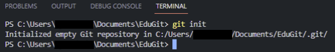
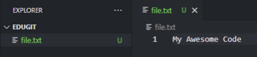

---

## テスト用Repositoriesの作成

{: width="500"}

[1 . インストールと環境設定 (Win&Mac)](https://hakunote.net/posts/edu-git-00/)で作成した実習フォルダを`VSCode`で開き、`Terminal`を開いてください。

<br/>

{: width="500"}

現在の実習フォルダでGitを使うために、以下のコマンドを入力して初期化します。

<br/>

###### <center>[Git初期化]</center>
```bash
git init
```

<br/>

{: width="100"}

初期化が完了すると、実習フォルダに`.git`フォルダが作成されたことを確認できます。

これで実習フォルダでGitを使う準備ができました！

<br/>

> `.git`が見えない場合は、隠しファイルを見えるように設定してみてください。
{: .prompt-info }

<br/>

---

## git add & git commit 実習



ファイルを作成し、内容を入力します。

実務といえば、コーディングをしたり、リソースを追加する行為になります。

<br/>


このAwesomeなコードをバックアップしたり、記録をしたい場合は、`git add`と`git commit`コマンドを使うことになります。

###### <center>[Git Add]</center>
```bash
git add ファイル名
git commit -m "メモや作業内容"
```

これでファイル(Awesome Code)を記録しました！

これからは、現在の状態に戻したり、いつどのような作業をしたか履歴を確認できるようになったので、安心して作業を進めることができます。


追加で、コードを書いて`add, commit`を実践してみましょう！

<br/>

---

## 必要なファイルだけを記録する方法

今まで実習で行った記録をバージョン生成と言います。

ファイルのバージョンを作りたい時(記録したい時)`add, commit`をすればいいと言ってましたが、考えてみると、
`「1回のコマンドですればいいのに、なぜわざわざ2回のステップが必要なのか？」`という疑問が生じませんか…？

簡単に言うと、全てのファイルを記録する必要がないからです。

例えば、テスト用の画像ファイルがあり、この画像ファイルはバージョンを記録する必要がない場合、`add`を使って記録したいファイルだけを選択し、`commit`を使って記録します。

<br/>

> `git add` : 記録したいファイルを選択
>
> `git commit` : 選択したファイルを記録
{: .prompt-info }

<br/>

## コマンドごとのGitの状態


`git add`をしたら選択したファイルが、`Staging Area`へ移動します。

`commit`をする前に、`commit`をしたいファイルを選択しておいて、これを(Staging Areaにファイルを入れる行為)`Staging`と言います。

<br/>

`Repository`は、`commit`されたファイルのバージョンたちを`保管`する場所になります。

`Staging area & repository` この二つはよく使う用語なので覚えておきましょう。

`add`と`commit`を一度に行うコマンドもありますが、特に使うことはありません。

<br/>

###### <center>[複数のファイルをStaging]</center>
```bash
# 複数のファイルを同時に、Staging
git add ファイル名1 ファイル名2
# すべてのファイルをStaging
git add .
```

<br/>

---

## commit履歴を確認


以下のコマンドで、これまでの`commit`履歴を確認することができます。

一度確認してみてください。

今は見づらいと思いますが、もう少しきれいで見やすい方法は、次回ご紹介します！

<br/>

###### <center>[commit履歴を確認]</center>
```bash
# 状態確認
git status
# commit履歴
git log --all --oneline
# グラフィックを適用してcommit履歴
git log --all --oneline --graph
```

<br/>

---

## Stagingされたファイルをキャンセルしたい場合は

間違いや心変わりなどで、`git add`後に`Staging`したファイルは、以下のコマンドでキャンセルすることができます。

###### <center>[Stagingファイルをキャンセル]</center>
```bash
git restore --staged ファイル名
```

<br/>

---

## 予想される質問

Q. どのくらいの頻度で`commit`するのが良いでしょうか？

A. ctrl + sを押すように、5秒ごとにcommitする必要はありませんが、簡単な機能を一つ追加する度に`commit`すれば良いかと思います。

例えば、ゲーム開発でキャラクターの操作を作る場合、

- キャラクターのリソースを追加して、commit
- キャラクターのオブジェクトを作成して、commit
- キャラクターの移動機能を作って、commit

このように小さな作業が終わったらcommitすることをお勧めします。

もちろん、3つ全部作ってからcommitする人もいます。（個人の好みによります）

<br/>

------

これでGitのadd、commitの実習が終わりました。

次回は、`git add、commit、diff`を簡単にする方法について説明します。