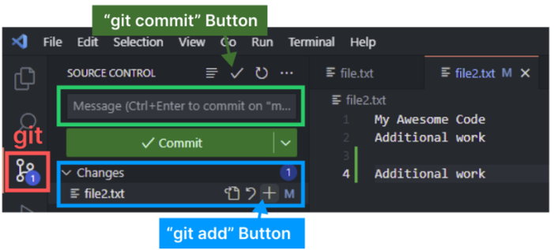
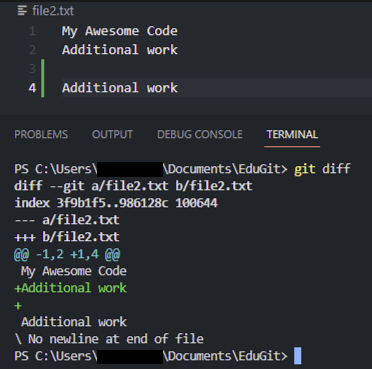
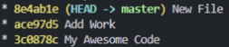
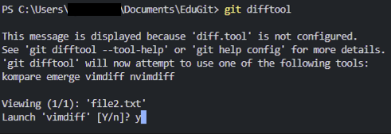
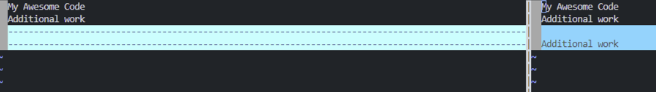
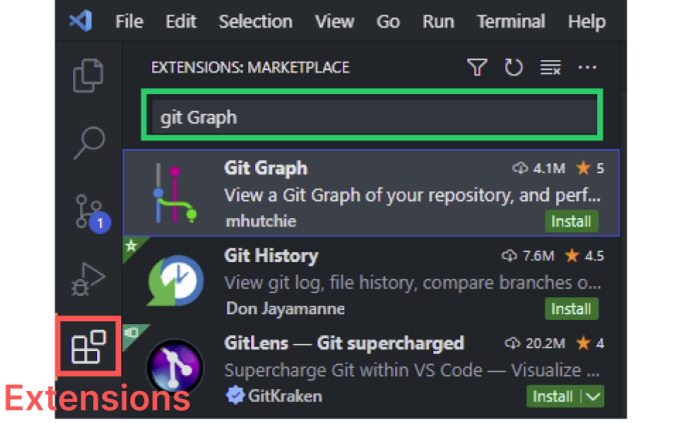
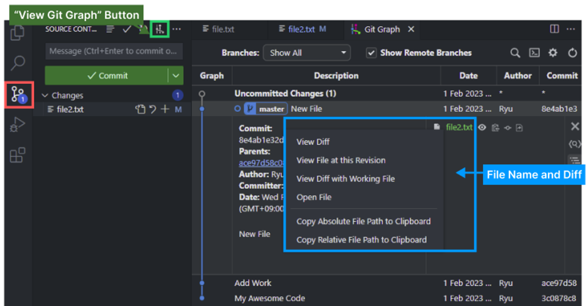

---

## VSCodeでgitを便利に使う方法

[2 . git add/commitで、ファイル記録](https://hakunote.net/posts/edu-git-01/)で`git add, commit`を実践してみましたか？
実は最近では、ターミナルで直接`git add`とかはあまりしません。(笑)

最近のIDEにはgitが内蔵されているか、インストールして使うことができるため、簡単に使えます。

#### VSCodeのGit
{: width="500"}

VSCodeの左側にあるアイコンがGitの機能です。

どのファイルが`変更・追加`されたかを確認できます。

Changesのリストで `「+」アイコン`が`Git add`になり、`Staging`されたファイルの場合、`「-」アイコン`で`add`を`キャンセル`することもできます。

ファイルを追加や変更した後、`「+」アイコン`をクリックして`add`し、`Message Input Field`に作業内容を入力して`「✓」アイコン`をクリックすると`git commit`になります！

次の`diff`の実習のため、直接`Commit`してください！

---

## Git Diff


`Commit`前に、現在のファイルと最近の`Commit`の違いを確認することができます。

自分がどの部分を`追加・変更`したかを確認するのに便利です！

###### <center>[Git Diff]</center>
```bash
# 現在のファイルと最近のCommitの比較
git diff
# 最近のCommitではなく、過去の特定のCommitと比較
git diff commitId
# 過去の特定の2つのCommit間の違い比較
git diff commitId1 commitId2
```


_黄色のテキストが、Commit Id_

追加、変更、削除された内容が`「-」「+」`の記号で表示され、これにより変更点を確認することができます。

#### Diff Tool
`Diff Tool`コマンドを使うと、もう少し見やすく`diff`を使うことができます。

###### <center>[Git Diff Tool]</center>
```bash
# 現在のファイルと最近のCommitの比較
git difftool
# 最近のCommitではなく、過去の特定のCommitと比較
git difftool commitId
# 過去の特定の2つのCommit間の違い比較
git difftool commitId1 commitId2
```

従来の`Diff`と使い方は大きく変わりませんが、`Diff Tool`コマンドを使うと…

{: width="500"}

上のようなメッセージと一緒に`vimdiff`の実行の有無が表示され`「y」`を入力して実行すると…

{: width="500"}

`Vimエディター`が起動し、従来のDiffより変更点が見やすくなります！

#### Git Diffの問題点とExtensions
すみません！

既に`Git Diff`について学習が終わりましたが、`Git Diff`は実際に見るのが大変ですし、時々削除していないのに`「-」`で削除されたと表示されるバグもあります。

そのため、私のおすすめは`VSCode`の`Extensions`を追加して使うことです！

{: width="500"}
_git graphのインストール_
Extensionsで`git graph`を検索してインストールすることができます。

{: width="500"}
_git graph使用_

インストールが完了したら、`Gitアイコン`をクリックして`Git`に移動し、`View Git Graph`をクリックすると`Git GUI`のように使えるようになります！

`Commit`された`Tree`を簡単に見ることができ、`Diff`の場合にも希望するポイントをクリックするとファイル名が表示され、ファイル名を右クリックしていろんなオプションで`Diff`を実行して比較ができます！

`ターミナル`が好きな人もいれば、`Extensions`を使う人もいますが、それは個人の好みです。
このポスティングで重要なことは、`Diff`を使って作業内容をチェックした後に`Commit`するのが良い習慣であることを覚えておいてください。

------

これでGitのDiffの実習が終わりました。

次回は、いよいよGitの花であるBranchについて見ていきましょう！