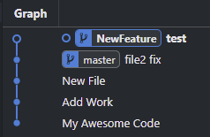

---

## Branchを作成する
Commitを続けて作業をしていると、突然新しい機能を追加する必要が生じることがあります。

また、複数の人が一つのプロジェクトで作業する場合、何かがうまくいかずにプログラムが壊れたらどうしますか？

安全に作業を続けるためには、プロジェクトのコピーを作成して開発するのが安全です。


{: width="800"}

gitでは、Branch機能を利用して簡単にコピーを作成できます。

> Branch = プロジェクトのコピー
{: .prompt-info }

<br/>

#### Branchの使い方

###### <center>[Branchコマンド]</center>
```bash
# 作成
git branch ブランチ名（機能名、自分の名前など）
# 作成したブランチに移動
git switch ブランチ名
# master(main) に戻りたい場合
git swich master(main)
# 現在どのブランチにいるか忘れた場合
git status
```


_NewFeatureブランチを作成・移動後、Statusを確認_

[3 . git add、commit、diffを簡単にする方法](https://hakunote.net/posts/edu-git-02/)で学習したように、 新しく作成したブランチで git add と git commit を使って作業をコミットしましょう。

<br/>





`HEAD`は現在自分がいる場所を意味し、Graphでは上記のように表示されます。

（既存のmasterがあり、masterから作成したNewFeatureという新しいブランチで、testというcommitを行った状態）

現在、新しいブランチで作業した内容はmaster(main)とは別の場所にあるため、互いに影響を与えません。

新しいブランチでの開発が終了したら、master(main)に統合してみましょう。

<br/>

{: width="800"}

ブランチを統合することを`Merge`と言います。
ブランチで開発した内容を master(main) ブランチと統合できます。

<br/>

#### Mergeの方法

###### <center>[Mergeコマンド]</center>
```bash
# master(main) ブランチに移動
git switch master(main)
# ブランチを統合
git merge ブランチ名
```

ターミナルで、git switch master コマンドを入力しても良いですが、以前にインストールしたGraphを利用するとさらに簡単です。


移動したいブランチをダブルクリックすると移動します。

もちろん`merge`も`Graph`を使って可能ですが、ここではコマンドで実習しましょう。

<br/>

#### Merge時、発生する可能性のある状況

ハッピーエンド


_問題なく正常に Merge 成功_


バッドエンド

バッドエンドをテストするため、準備してみましょう。

master(main) で新しいブランチを作成し、再び master(main) に戻って、1行目の内容を修正後、commitしました。

新しいブランチに再び移動して、同じファイルの1行目を別の内容に修正後、commitしました。

その後、masterに戻り、新しいブランチを merge する前の状態が以下のGraphです。


この状態で新しいブランチを master(main) に merge してみましょう。


このような画面に変わり、CONFLICT が発生したことを確認できます。つまり、衝突が発生したのです。

<br/>

#### CONFLICT 解決方法

CONFLICT の解決方法は、まず画面の意味を理解することです。


###### <center>[CONFLICT]</center>
```bash
 <<<<<<< HEAD  # 自分がいる場所、ここでは master(main)
 My Master Bad Code # master(main) で conflict が発生した部分
 =======
 My Feature Bad Code # merge 対象のブランチで conflict が発生した部分
 >>>>>>> NewFeature2 # master(main) に merge しようとした対象のブランチ
```

```bash
<<<<<<<< HEAD
内容
=========
内容2
>>>>>>>>> MergBranch
```

修正方法は簡単です。======= を中心に`conflict`が発生した部分が分かれており、その中から最終的に残したい部分だけを残して削除するか、完全に別の内容に置き換えることが可能です。


_私は二つの内容と異なる新しい内容に修正しました。_


------

協力作業時に`branch`は必須です。

複数の開発者が同じプログラムを作成する際、10人が同時に同じコードを修正して保存すると恐ろしい事態が発生します！

最も基本的な協力ルールを考えると次のようになります。

1. 作業前に`branch`を作成する、新しく作成した`branch`で機能を開発する。
2. 作業が完了したらテスト後、問題がなければ master(main) に `merge` する。
3. conflictが発生した場合、担当者と協議の上、修正後、再度`merge`する。

これだけでも、より安全に開発を進めることが可能です！

------

これで、`Branch`の実習が終わりました。
次回は、様々なマージ方法 (3-way, fast-forward, squash, rebase)について見ていきましょう！
