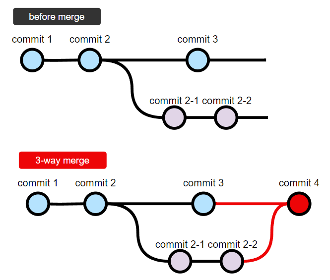
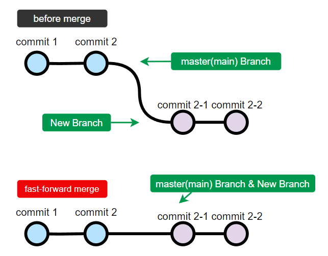
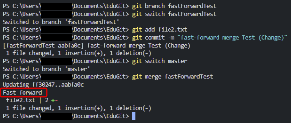
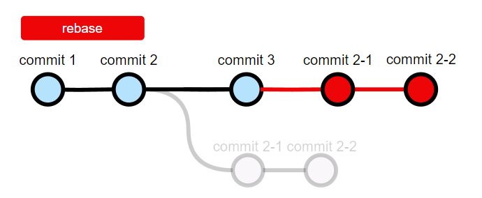
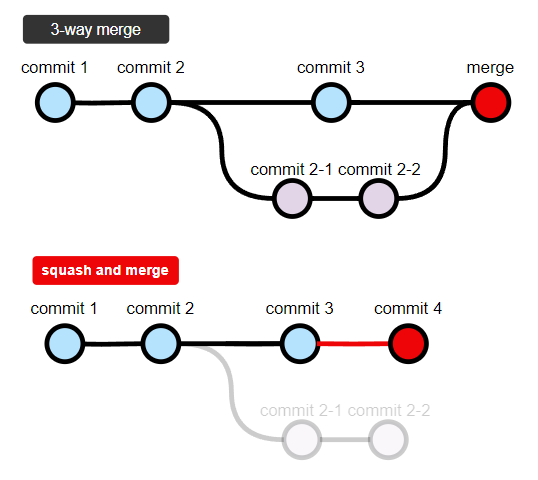

---

## さまざまな merge 方法

Git では、複数のブランチで行われた変更を統合するためのさまざまな方法があります。  
今回は、下記4つについて詳しく見ていきましょう。

 - 3-way merge
 - fast-forward merge
 - rebase 
 - squash merge

<br/>

---

#### ・3-way merge

{: width="800"}

[4 . gitで、branchを作成する](https://hakunote.net/posts/edu-git-03/)で学習したようにBranchでそれぞれ新規Commitが1回以上ある時、  
Mergeコマンドを実行すると二つのBranchをMergeして、新しいCommitを自動で生成します。

これが`3-way merge`であり、`mergeの基本的な動作方法`です。

>  3つのCommitを使ってMerge  
>（共通の親Commit、現在のブランチのCommit、マージ対象のブランチのCommit）
{: .prompt-info }

<br/>

---

#### ・fast-forward merge



新規BranchにCommitがあり、基準となるMaster Branchに新規Commitがない場合、  
Mergeをすると`fast-forward merge`が、自動的に実行されます。

この場合、特にMergeするものがないので、実際に`新規Branchが、Master`になります。


_fast-forward_

> 自動的に`fast-forward merge`されるのが嫌なら、  
> `git merge --no-ff ブランチ名` で強制`3-way merge`も可能です。
{: .prompt-info }

<br/>

---

#### ・rebase and merge



指定したBranchの基点を別のBranchの最新のCommitに移動させる方法です。

分解して説明すると、Rebaseを使って新規Branchの開始点をMaster Branchの最近のCommitに戻した後、  
`fast-forward merge`をすることです。  
よく使われる方法ではありませんが、通常`rebase and merge`する理由は下記のとおりです。  

(Branch間の差分が多い場合、Rebase時にConflictが頻繁に発生するし、解決が面倒なので私も使いません。)

> 3-way mergeではなく、強制的にfast-forwardしたい時。  
> Commit履歴を一行で連続して残したい時。  
> 変更履歴を分かりやすくするため。  
> プロジェクトルールがそうだから。

なので、まずは方法だけでも知っておきましょう。

<br/>

###### <center>[rebase and merge方法]</center>
```bash
git branch 新規ブランチ
git rebase master(main)

git switch master(main)
git merge 新規ブランチ
```

新規Branchへ先に移動した後、`git rebase master(main)`をしたらBranchがMaster Branchの最後に移動することになりますが、この時、`fast-forward merge`をすることです。

`fast-forward merge`をしたい時、その条件に合わない場合、強制的に条件に合うように作ってMergeを利用して強制的に`fast-forward merge`をすることができるようにすることです。

<br/>

---

## squash and merge



普通は、Rebaseと同じ理由で使うことになります。

`3-way merge`だけだったプロジェクトで、`git log`を使って履歴を見るとかなり複雑なことが分かります。  
このような時、RebaseやSquashをすることになります。  
(上記の理由で私もよく使います。)

複数のCommitを一つにまとめるため、最終的には一つのCommitにまとめられ、  
履歴がシンプルになります。

<br/>

###### <center>[squash and merge方法]</center>
```bash
git switch master(main)
git merge --squash ブランチ名
git commit -m 'メッセージ'
```

上記の順番で、新規Branchで作業したCommitを一つのCommitに、  
Mergeして`master(main)`に生成されます。  
Rebaseと違って、Mergeする時、オプションで`--squash`を追加すれば終わりなので便利です！

<br/>

---

## ブランチの削除

今回の学習で、Branchがたくさん増えたと思います。  
MergeをしてもBranchは自動的に削除されないからです。  
次の学習に移動する前に、下記のコマンドでプロジェクトを綺麗に整理してください！

<br/>

###### <center>[branch 削除]</center>
```bash
# Mergeが完了したBranchの削除時
git branch -d ブランチ名
# MergeしていないBranchの削除時
git branch -D ブランチ名
```

> コマンドオプションの大文字と小文字に注意してください。
{: .prompt-warning }

<br/>

---

## どのようなMerge方法を使うべきでしょうかね？

本ポスティングの対象であるジュニア時代は、  
`「以前は3-way mergeをやったから、今回はsquashをやってみよう」`みたいな感覚で、全ての方法を試してみることをお勧めします。

結局、実務ではプロジェクト別にルールが決まっているはずです。  
(重要なBranchごとに、Mergeルールが存在するとか、3-way mergeだけするとか)

------

これで、`様々な merge`の実習が終わりました。  
次回は、本当に本当に便利な(revert, reset, restore)について見ていきましょう！