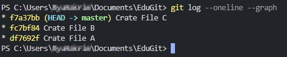
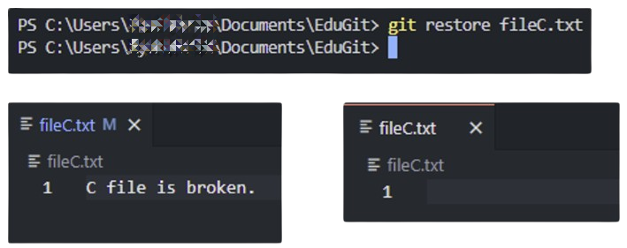
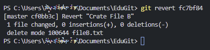
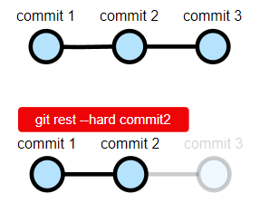

---

## gitは、バージョン管理プログラム
Git はバージョン管理プログラムであることを、もう一度思い出しましょう。  
作業がうまくいかなかったり、問題があった場合、いつでも以前のCommitに戻ったり、問題のあるCommit履歴をキャンセルすることができます。  



きれいに実習するため、新しくプロジェクトを始めましょう。  
[1 . インストールと環境設定 (Win&Mac)](https://hakunote.net/posts/edu-git-00/)を参考にして、作業フォルダを初期化し、ファイルを作成してCommitを3回ほど進めてください。  

<br/>

---

## git restore
作業中に内容が間違っていた場合、`Ctrl+Z`で元に戻すなどを使用しますが、その内容が大きすぎる場合は、`restore`を使用して一度に修正前の状態に戻すことができます。

<br/>

###### <center>[git restore コマンド]</center>
```bash
# 最近 Commit された状態に現在のファイルの修正内容を戻す
git restore ファイル名
# 入力したファイルを特定の Commit ID 時点に復元
git restore --source CommitID ファイル名
# 復元とは関係ないが、これで特定のファイルのStagingをキャンセルできる
git restore --staged ファイル名
```

#### 実習_1. FileCが正常に動作しない！作業内容を破棄して最近のCommit状態に戻そう



壊れた`FileC`が最も最近のCommitに戻りました。

<br/>

---

## git revert


一生懸命作業中に、過去のCommitである`FileB`に問題が発生しました。  
このような場合、FileBのCommitを削除するコマンドは残念ながら存在しません。  
代わりに、`FileB`のCommitをキャンセルするCommitを生成する方式を取ります。

<br/>

###### <center>[git revert コマンド]</center>
```bash
git revert CommitID
```

#### 実習_2. 上記3つのCommitのうち、FileBに問題が多いためfc7bf84 Commitをキャンセルしたい。



コマンドを入力すると、下記のような画面が表示されます。  
(環境によって異なる場合もある)  
ここでCommitに対するメッセージを変更することもできますが、私はそのまま使用しました。

.png)

その後、この画面を閉じると、該当CommitをキャンセルするCommitが生成され、キャンセルしたCommitの内容である`FileB.txt`ファイルが消えたことを確認できます。


結論として、`revert`コマンドで特定のCommitで行われた作業を消すことができます。

> ・`revert`する際、同時に複数のCommit IDを入力可能  
> ・最近行ったCommitを1つだけ`revert`したい場合は、`git revert HEAD`と入力すると便利  
> ・mergeコマンドによって新しく作成されたCommitも`revert`可能（mergeがキャンセルされる）
{: .prompt-info }

<br/>

---

## git reset
すべてを元に戻したい！`reset`は過去に移動可能なタイムマシンです。  
`reset`を使用すると、特定のCommitの時点にすべてを戻すことが可能です。  
もちろん、作業フォルダのファイルも元に戻すことが可能です。

<br/>

###### <center>[git reset コマンド]</center>
```bash
git reset --hard CommitID
```



`hard`オプションを使用して、すべてを削除（記憶喪失）することも可能です。

> ・複数人で協業中のリポジトリでは`reset`使用時に注意！   
> ・untracked ファイル（git addしていないファイル）は`消えずに維持`される。  
> ・git cleanコマンドを使用すると、untrackedファイルも`すべて削除`することもできる。
{: .prompt-info }

<br/>

## 参考：reset時にオプション設定


再び最初に戻って、`FileA、B、C`を作成し、それぞれCommitした状態です。  
`git reset`の後に`hard / soft / mixed`オプションを付けることができます。

<br/>

###### <center>[git reset オプション]</center>
```bash
# a, bファイルは残っていて、cファイルが削除される
git reset --hard fc7bf84

# a, cファイルは残っていて、bファイルはStaging Areaに残っている
git reset --soft fc7bf84

# a, cファイルは残っていて、bファイルはStagingされていない状態になる
git reset --mixed fc7bf84
```

結論として、`reset`で、ファイルを完全に削除するのではなく、検討して再度Commitしたい場合は`--soft / --mixed`を使用します。  
(実は、`git reset`だけで実行すると、`--mixed`オプションが自動的に適用されます。)


<br/>

------

これで、`restore, revert, reset`の実習が終わりました。  
次回は、GitHubの使い方第1回 `git push`について見ていきましょう！