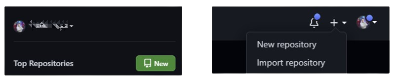
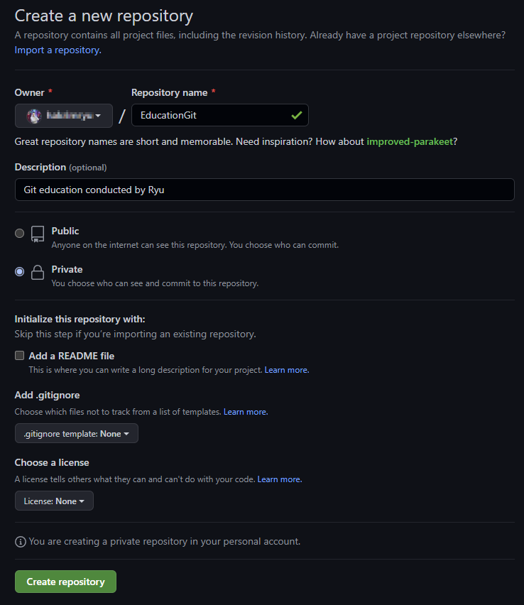
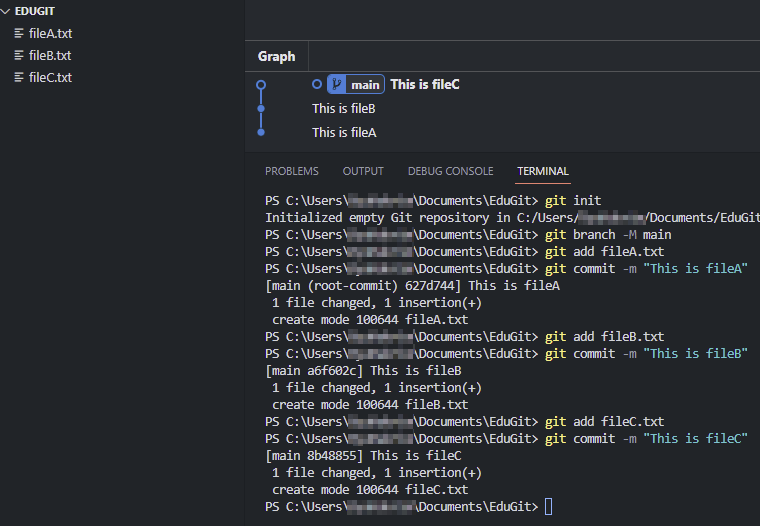
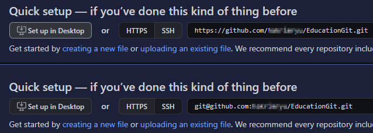
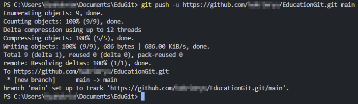
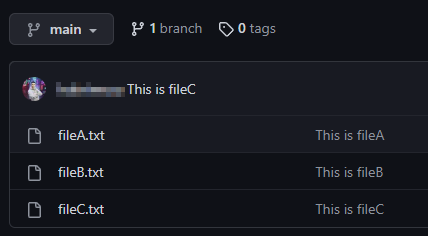
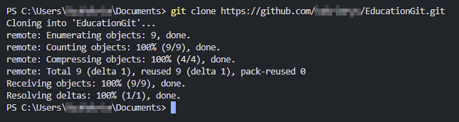
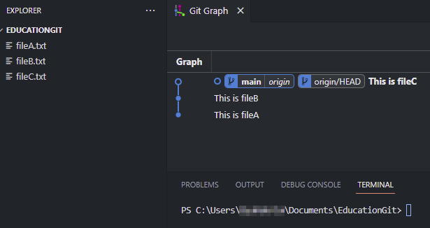

---

## pushを学習する前に
`Push`を学習する前に、`Repository`の概念と、なぜ使用する必要があるのかを知る必要があります。

> Repository：保管所 (貯蔵庫)
{: .prompt-info }

Gitがファイルバージョンを保存しておく場所を`Repository`と呼びます。  
ローカル作業フォルダには`.git`フォルダ（隠しフォルダ）がありますが、それが`Repository`です。  

実際に開発する際は、開発環境の制約と協業のためにオンラインの`Repository`をよく使用します。  
簡単に言えば、自分のPCに作成した`Git Repository`をオンラインで保存しておくことです。  
ここでは主によく使用される`GitHub`を利用して説明します。

<br/>

---

## GitHubとは


`GitHub`は、ソフトウェア開発プロジェクトのためのウェブベースのホスティングサービスです。  
Gitを使用したバージョン管理と協力作業を支援します。  

[主な特徴]  
1. コードの保存と共有：プロジェクトのコードをオンラインで保存し、チームメンバーと共有できる。
2. バージョン管理：Gitを使用して、コードの変更履歴を追跡し管理する。
3. 協力作業：複数の開発者が同じプロジェクトで作業し、変更を統合できる。
4. プルリクエスト：コードレビューと変更の提案を簡単に行える。
5. イシュートラッキング：プロジェクトの課題や改善点を管理できる。
6. ウェブホスティング：静的ウェブサイトを直接ホストできる。

`GitHub`は、オープンソースプロジェクトから企業の大規模開発まで、幅広く使用されています。  
ため、私たちもGitHubを使って実習します！

<br/>

---

## GitHubに登録してRepositoryを作成
[GitHub](https://github.com/)のリンクから移動後、登録してください。  
本ポスティングでは、`GitHub`の登録説明はPassします！



`Repository`は、`GitHub`にログインし、メインページの左上の`Newボタン`か、右上の`+ボタン`をクリックした後、`New repository`を選択して作成できます。



自由に入力し、下の`Create repository`ボタンをクリックして作成します。  
さて、それでは新しくプロジェクトを作成して、`Local Repository`を作成した  
`Remote Repository`（GitHub）にバックアップしてみましょう。

<br/>

---

## Local Repositoryで、プロジェクトを作成

1. `git init`で、`Local Repository`を作成
2. `GitHub`では、基本Branchを`master`ではなく`main`を使用するよう推奨しています。  
そのため、`Local Repository`の基本Branch名を`master`ではなく`main`に変更します。
(既にmainの場合は大丈夫、いつでも基本Branchを変更可能)
```bash
# 基本Branch名をmainに変更
git branch -M main
```
3. これまでのように、テスト用のファイルとCommitを数個作成しましょう。


<br/>

---

## GitHubで作成したRemote Repositoryにアップロード
Local Repository -> Remote Repository
```bash
git push -u Remote Repositoryアドレス main
```
・`Local Repository`の`main` Branchを`Remote Repository`に`アップロード`するという意味です。  
・他のBranchもアップロード可能です。  
・`GitHub`のログインを求められたら、ログインしてください。  
・`-u`オプションは、今入力したアドレスを記憶しておくという意味で、次回からは長いアドレスを入力せずに`git push`だけで問題ありません。



`Remote Repository`のアドレスには、`HTTPS`と`SSH`方式があります。  
`SSH`は複雑なので、まずは`HTTPS`で実習しましょう。





成功のメッセージとともに、`GitHubで`確認すると、`main` Branchに`Push`したファイルを確認できるようになりました。

結論！`Local Repository`で作業して`git push`を使って`remote Repository`へアップロードしましょう！

<br/>

---

## 参考：Remote Repositoryアドレスの長い入力が面倒なら？
毎回アドレスを書くのが面倒な場合、変数を使用するのも便利な方法です。

###### <center>[Remote Repositoryのエイリアス設定]</center>
```bash
git remote add origin Remote Repositoryアドレス
# 変数リストを表示
git remote -v
```

これで、`Remote Repository`アドレスが、`origin`という変数に割り当てられ、次回使用する時は
```bash
git push -u origin main
```
だけで、同じ結果が得られます。

<br/>

---

## clone：Remote Repositoryにあるものをそのままダウンロード
現在のターミナルの位置で`Remote Repository`をクローンし、`Local Repository`を作成します。

```bash
git clone Remote Repositoryアドレス
```





これのみで、`Clone`は完了です！

<br/>

---

## Remote Repositoryにアップロードしないファイルは？
開発をしていると、`Remote Repository`に`アップロードしないファイル`が存在します。  
(共有する必要がないとか容量が大きいなど)  

このような場合、`.gitignore`ファイルを作成して、`Repository`にアップロードしないファイルやフォルダを指定できます。  
`git add`をしても　Stagingされないので便利です。  

使用方法は、Google検索するか、`GitHub`で`Repository`作成時に`add .gitignore`というところで、自分のプロジェクトの種類を選択すると、基本的なものは自動的に作成してくれます。 
 
その後、生成されたフォーマットを見てルールを把握した後、自分が登録したい除外ファイルやフォルダを追加しながらプロジェクトを進めることになります。

<br/>

------

これで、`GitHubの使い方第1回、git push`の実習が終わりました。  
次回は、GitHubの使い方第2回 `git pull`について見ていきましょう！