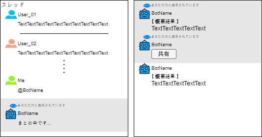
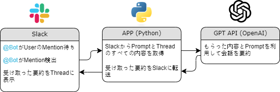
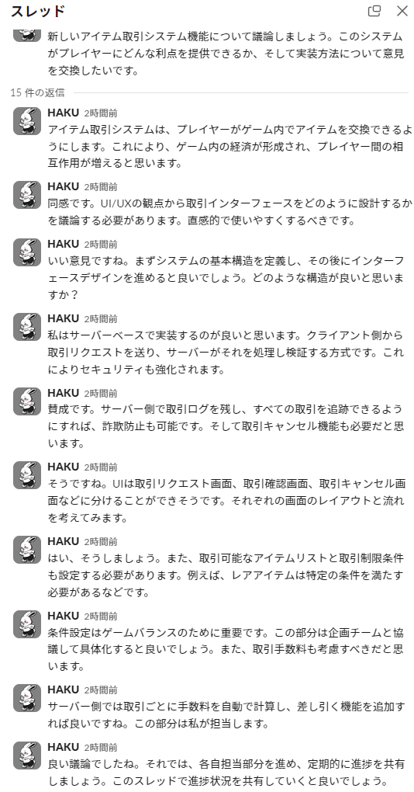
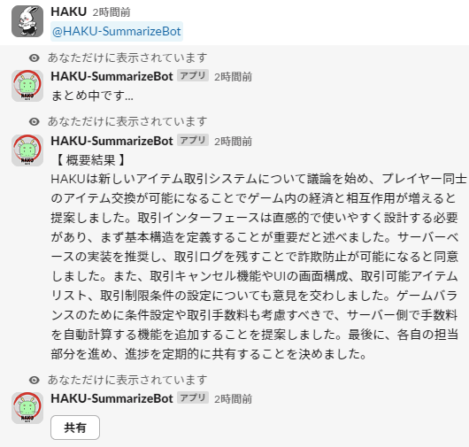
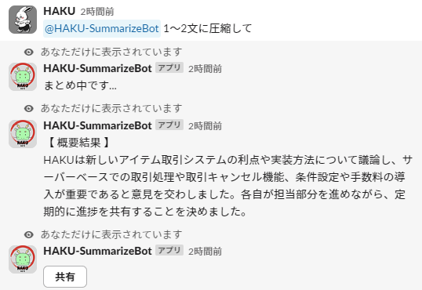
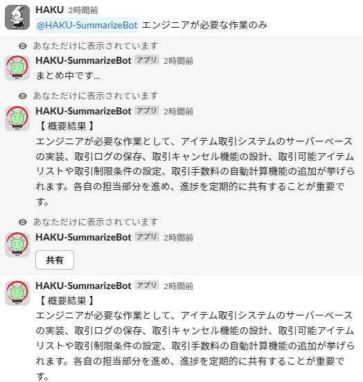
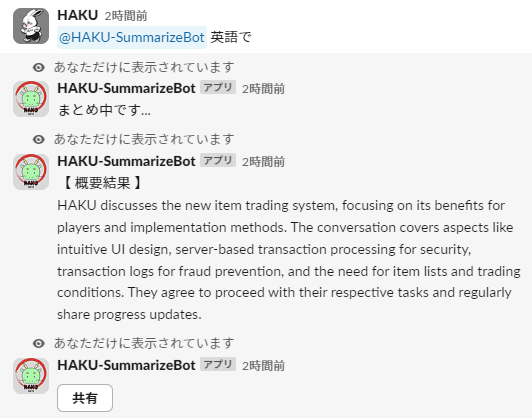

---

## はじめに
最近、ほとんどの会社でSlackが使われています。    
私もSlackを利用しているのですが、Slackの内容を把握するのに多くの時間を費やしています。


例えば、私のメンションが追加されて「上記の内容をお願いします！」と連絡が来ることがあり、スレッド内のメッセージが100件以上の場合もあります。  
また、休暇後に戻ってきたときに、把握しなければならないスレッドが多いと、1日が業務の把握だけで終わってしまうのは非常に残念だと感じました。  

最近、OpenAIから`GPT-4o-mini`が発売されて、価格が安いし、スレッドの全内容を要約してくれる`Bot`を作って、スレッドの把握時間を節約できると思いました！

<br/>

---

## APP仕様

{: width="800"}

簡単に、仕様をイメージでまとめてみました。

1. 要約したい`スレッド`で、Botをメンション。
2. Botが、動いていることがわかるように`「まとめ中です...」`というメッセージを`非公開`で表示。
3. 要約が完了すると、自分だけが確認できる`非公開の要約内容`を受ける。
4. 要約と同時に、`非公開で共有ボタン`を表示。
5. `共有ボタン`をクリックすると、要約内容をスレッドに共有。

> 追加事項  
> 1.基本の要約プロンプトは、APPに内蔵し、Botをメンションするだけで要約。  
> 2.メンション後に、追加のプロンプトを入力して、より効率的に使用可能にする。  
>
> 例) @bot 英語で、@bot 一文で、@bot エンジニアが必要な作業だけ
{: .prompt-info }

<br/>

---

## 技術スタック及びアーキテクチァー
- 言語
> Python 3.8+  

- 主要ライブラリ  
> slack_bolt : Slackアプリ開発のためのフレームワーク  
> langchain : LLMとの相互作用のためのフレームワーク  
> python-dotenv : 環境変数管理

- API  
> Slack API: `Bot`機能の実装とメッセージ処理  
> OpenAI API: `GPT-4o mini`モデルを用いたテキスト要約  

<br/>

{: width="800"}

- Slackイベントリスニング
> `slack_bolt`ライブラリを使用してSlackイベントを受信。  
> メンション(@BotName)を通じて、`Bot`を呼び出し。

- スレッド内容抽出
> `Slack API`を使用して、メンションされたスレッドの`全体の会話内容`を取得。  
> User IDを実名に変換して、読みやすくする。

- GPT-4o miniを利用した要約
> `langchain`ライブラリで、OpenAIの`GPT-4o mini`モデルと連携。  
> スレッド内容を`GPT-4o mini`に渡して`要約を生成`。

- カスタムプロンプト
> Userがメンションと共に、`特定の指示`を入力。  
> 基本要約プロンプトに、Userのプロンプトを追加して、柔軟な要約が可能。

- 非同期処理
> 要約中であることを知らせるメッセージを先に送信して、User体験を向上させる。

- プライバシー考慮
> 要約結果は、要請したUserのみに表示。    
> `共有ボタン`を通じて、要約を`スレッドに公開`するオプションを提供。

<br/>

---

## 主要コード説明

```py
#==========================================
# 必要なモジュールをインポート
#==========================================
import os
from dotenv import load_dotenv
from slack_bolt import App
from slack_bolt.adapter.socket_mode import SocketModeHandler
from slack_sdk import WebClient
from langchain_openai import ChatOpenAI
from langchain_core.messages import HumanMessage
```

- 必要なモジュールをインポート
> `dotenv`を使用して、環境変数をロードし、`Slack Bolt`と`Slack SDK`を使用して、  
> Slackイベントを処理します。

```py
#==========================================
# 初期化
#==========================================
# .envファイルから環境変数を読み込む
load_dotenv()

# Slackアプリケーションを初期化
app = App(token=os.getenv("SLACK_BOT_TOKEN"))
client = WebClient(token=os.getenv("SLACK_BOT_TOKEN"))

# OpenAI GPTモデルを初期化
chat = ChatOpenAI(temperature=0.7, max_tokens=2048, model_name="gpt-4o-mini")

# デフォルトの要約プロンプ
default_summary_prompt = "次の会話を日本語で要約してください"
```

- 初期化
> 環境変数をロードし、SlackアプリとOpenAI GPTモデルを`初期化`します。  
> `gpt-4o-mini`を使用し、プロンプトを通じて基本的に`日本語で要約`を注文します。

<br/>

```py
#==========================================
# ユーティリティ関数
#==========================================
# ボットのユーザーIDを取得
def get_bot_user_id():
    try:
        response = client.auth_test()
        return response["user_id"]
    except Exception as e:
        print(f"ボットユーザーIDの取得に失敗しました。: {e}")
        return None

# ユーザーの実名を取得
def get_user_name(user_id):
    try:
        user_info = client.users_info(user=user_id)
        return user_info["user"]["real_name"]
    except Exception as e:
        print(f"ユーザー名の取得に失敗しました。: {e}")
        return user_id
```

- get_bot_user_id  
> Slack APIの`auth_testメソッド`を使用して、`BotのUser ID`を取得します。  
> これは、Botがメンションされたメッセージで、自分を識別するために必要です。  

- get_user_name  
> 指定された`User ID`を使用して、Slack APIの`users_infoメソッド`で、Userの実名を取得します。  

<br/>

```py
#==========================================
# メインイベントハンドラ
#==========================================
# ボットがメンションされたときのイベントハンドラ
@app.event("app_mention")
def handle_mention(event, say):
    # スレッドのタイムスタンプを取得
    thread_ts = event.get("thread_ts", event["ts"])
    channel_id = event["channel"]
    user_id = event["user"]
    
    # カスタムプロンプトを抽出
    if BOT_USER_ID:
        custom_prompt = event["text"].split(f"<@{BOT_USER_ID}>")[1].strip()
    else:
        custom_prompt = event["text"].strip()
    
    # 要約プロンプトを設定
    summary_prompt = f"{default_summary_prompt} {custom_prompt}" if custom_prompt else default_summary_prompt
    
    # 要約中メッセージを送信（あなただけに表示されています）
    client.chat_postEphemeral(
        channel=channel_id,
        user=user_id,
        thread_ts=thread_ts,
        text="まとめ中です..."
    )
    
    # スレッドの会話を取得
    result = client.conversations_replies(channel=channel_id, ts=thread_ts)
    messages = result["messages"]
    
    # 会話を整形
    conversation = "\n".join([f"{get_user_name(msg['user'])}: {msg['text']}" for msg in messages if msg['user'] != BOT_USER_ID])
    
    # GPTモデルを使用して要約を生成
    summary = chat.invoke([HumanMessage(content=f"{summary_prompt}\n\n{conversation}")]).content
    
    # 要約結果を送信（あなただけに表示されています）
    client.chat_postEphemeral(
        channel=channel_id,
        user=user_id,
        thread_ts=thread_ts,
        text=f"【 概要結果 】\n{summary}"
    )
    
    # 共有ボタンを追加（あなただけに表示されています）
    client.chat_postEphemeral(
        channel=channel_id,
        user=user_id,
        thread_ts=thread_ts,
        text="要約を共有しますか？",
        blocks=[
            {
                "type": "actions",
                "elements": [
                    {
                        "type": "button",
                        "text": {"type": "plain_text", "text": "共有"},
                        "value": summary,
                        "action_id": "share_summary"
                    }
                ]
            }
        ]
    )
```

- スレッドのタイムスタンプを取得  
> thread_tsを取得して、現在のスレッドのタイムスタンプを確認します。

- カスタムプロンプトを抽出  
> メンションされたメッセージからボットのユーザーIDを基準にカスタムプロンプトを抽出します。

- 要約プロンプトの設定  
> デフォルトの要約プロンプトにカスタムプロンプトを追加して、最終的な要約プロンプトを設定します。

- 要約中メッセージの送信  
> 要約作業が始まったことを知らせるメッセージをユーザーにエフェメラルメッセージで送信します。

- 会話内容を取得  
> 対象スレッドの全ての会話内容をSlack APIを使って取得します。

- 会話内容の整形  
> 会話内容をユーザー名とともに整形します。

- GPTモデルを使った要約生成  
> 整形された会話内容をGPTモデルに渡して要約を生成します。

- 要約結果の送信  
> 生成された要約結果をユーザーにエフェメラルメッセージで送信します。

- 共有ボタンの追加  
> ユーザーが要約を他の人と共有できるように共有ボタンを追加したメッセージを送信します。

<br/>

---

## 使用例


_(テスト例文)_


_(基本要約)_


_(プロンプトを使用した例 1)_


_(プロンプトを使用した例 2 or 共有ボタンをクリック)_


_(プロンプトを使用した例 3)_

------

## API Documentation LINK

#### Slack API
- **Slack Bolt for Python**: [Slack Bolt for Python Documentation](https://slack.dev/bolt-python/concepts)
- **Slack SDK**: [Slack Web API Documentation](https://api.slack.com/web)

#### OpenAI API
- **OpenAI GPT-4**: [OpenAI API Documentation](https://platform.openai.com/docs/guides/gpt)

#### Library
- **LangChain**: [LangChain Documentation](https://docs.langchain.com/docs/)
- **python-dotenv**: [python-dotenv Documentation](https://saurabh-kumar.com/python-dotenv)