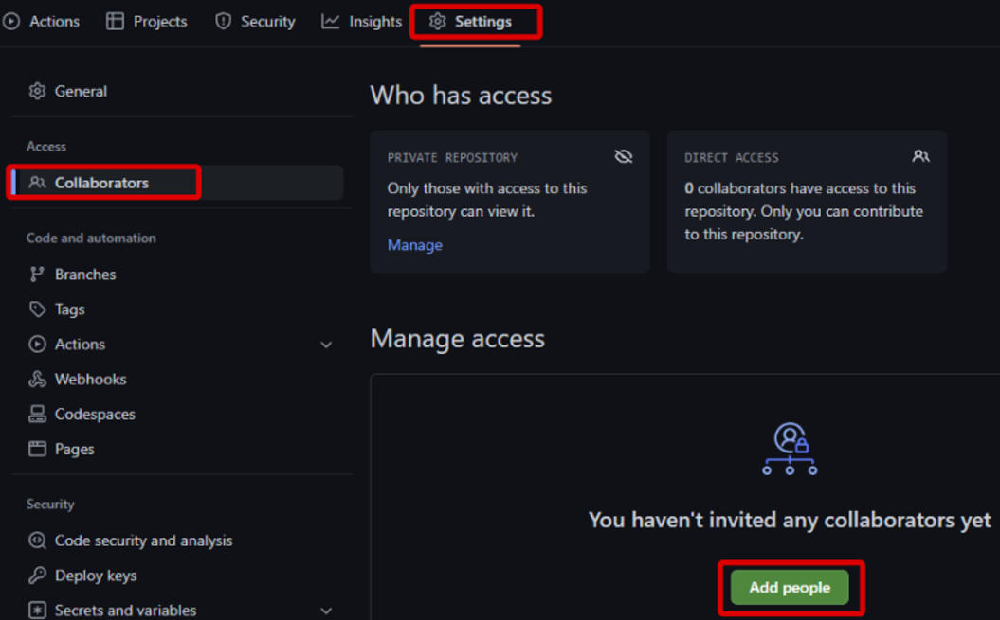
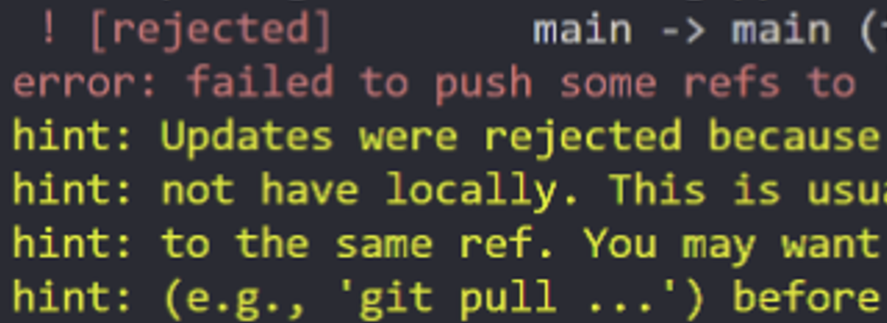

---

## 協業
リモートリポジトリの最大の利点は、やはり協業が可能なことです。 
難しいことは何もなく、作業者が2人以上いて、それぞれの作業をリモートリポジトリにプッシュすれば、それが協業だと思います！

もちろん、今は一人で作業しているので、協業をしていると仮定してシミュレーションしてみましょう。

新しいチームメンバーは、まず何のプロジェクトも持っていないので、
[7 . (GitHubの使い方第1回) ファイルをアップロードする時は git push](https://hakunote.net/posts/edu-git-06/)のようにリモートリポジトリをクローンして、ローカルリポジトリを作成する必要があります。

{: width="800"}

その前に、リポジトリの権限を付与するためには、GitHubのプロジェクトで`Settings`に移動し、`Collaborators`を選択して`Add people`ボタンをクリックすると、新しいチームメンバーを招待することができます。  
その後、git cloneを実行しましょう！

<br/>

---

## チームメンバーがcommitしようとして問題が発生
例えば、私が新しいファイルを作成して commit したとします。  
このとき、別のチームメンバーが新しいファイルを作成してcommitし、pushしようとするとエラーが発生します。

{: width="350"}

リモートリポジトリとローカルリポジトリの内容が異なる場合、ローカルリポジトリで、git pushを実行するとエラーが発生します。  
適当にpushしてしまうとコード管理ができなくなるため、事前に予防してくれるのです。

そのような場合に使うのが！

<br/>

---

## git pullを利用してリモートリポジトリの最新の内容を取得

```bash
git pull リモートリポジトリURL
```

pushする前には必ずpullする習慣をつけましょう。  
このコマンドはリモートリポジトリにあるすべてのブランチの内容を取得して、ローカルリポジトリにマージすることを意味します。  
これを実行するとローカルが最新の状態になるため、git pushが可能になります。  
結論としては、変更が発生した場合はgit pullを実行してからgit pushを実行すれば良いと思います！


> `git pull リモートリポジトリURL ブランチ名`と入力すると特定のブランチだけを取得することができます。　
>
> 変数名を登録していれば、便利です！
>
> 以前に-uオプションを使用した場合、git pull、git pushだけで問題なく実行できます。
{: .prompt-info }

<br/>

---

## 参考情報 : git pullコマンドはgit fetch + git mergeの省略形
git pullを実行すると、自動的にgit fetchとgit mergeが実行されます。  
git fetchは、リモートリポジトリにあるコミットの中で、ローカルにない新しいコミットを取得することを意味し、git mergeはそれをマージすることを意味します。

したがって、git pullを実行した際に、2人のチームメンバーが同じファイルを編集している場合、マージコンフリクトが発生することがあります。
コンフリクトは前回学習した通りに解いてみてください！


------

これで、`GitHubの使い方第2回、他の人と協業 git clone, pull`の実習が終わりました。  
短い内容ですが、お互いに協業をしながら、多くの試行錯誤とコミュニケーションを通してチームのルールを作っていくことが最も重要だと思います。  
次回は、GitHubの使い方第3回 `pull request`について見ていきましょう！